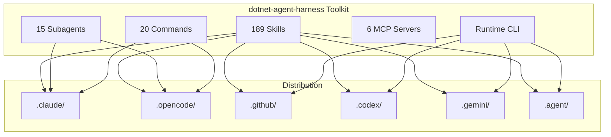

## Quick Start

```bash
# Install the runtime tool
dotnet new tool-manifest
dotnet tool install Rudironsoni.DotNetAgentHarness

# Bootstrap agent targets in the repo
dotnet agent-harness bootstrap \
  --targets claudecode,opencode,codexcli,geminicli,copilot,antigravity \
  --run-rulesync
```

## Maintainer Runtime

```bash
# Build the runtime CLI and eval runner
dotnet build src/DotNetAgentHarness.Tools/DotNetAgentHarness.Tools.csproj
dotnet build src/DotNetAgentHarness.Evals/DotNetAgentHarness.Evals.csproj

# Pack the runtime as a .NET tool
dotnet pack src/DotNetAgentHarness.Tools/DotNetAgentHarness.Tools.csproj

# Prepare a repository-aware prompt bundle
dotnet agent-harness \
  prepare-message "Review the validation pipeline" \
  --target src/DotNetAgentHarness.Tools/DotNetAgentHarness.Tools.csproj \
  --platform codexcli \
  --write-evidence \
  --evidence-id review-validation

# Diff prompt bundles or capture incidents
dotnet agent-harness \
  compare-prompts review-validation review-validation-v2
```

## Platform Support

<div class="platforms">

| Platform       | Status             | Primary Agent      |
| -------------- | ------------------ | ------------------ |
| Claude Code    | ✅ Fully Supported | `dotnet-architect` |
| OpenCode       | ✅ Fully Supported | `dotnet-architect` |
| GitHub Copilot | ✅ Fully Supported | All agents         |
| Codex CLI      | ✅ Fully Supported | All agents         |
| Gemini CLI     | ✅ Fully Supported | All agents         |
| Antigravity    | ✅ Fully Supported | All agents         |

</div>

## Architecture Overview



## Latest Enhancements

### Runtime and Governance

- **Installable runtime**: `DotNetAgentHarness.Tools` now packs as a `.NET tool` with command `dotnet agent-harness`.
- **Bootstrap flow**: `bootstrap` writes the local tool manifest, `rulesync.jsonc`, repo state, and can generate all
  supported target outputs.
- **Runtime-backed commands**: generated `dotnet-agent-harness:*` command files are expected to call the local runtime
  instead of duplicating logic in prompt text.
- **Release workflow**: GitHub Actions now packs, smoke-installs, and publishes the tool package to GitHub Packages,
  with optional NuGet.org publication.
- **Prompt assembly**: `prepare-message` builds persona-aware prompt bundles from repo analysis, skills, and target
  resolution.
- **Prompt evidence**: prepared-message reports and rendered prompts can be persisted under
  `.dotnet-agent-harness/evidence/`.
- **Prompt diffing**: `compare-prompts` shows section-level changes across system, tool, skill, and request layers.
- **Incident tracking**: `incident add`, `from-eval`, `resolve`, and `close` link failures to prompt evidence and
  regression cases.
- **Eval artifacts**: the eval runner emits machine-readable artifacts that can be consumed by CI and governance
  workflows.
- **CI auto-linking**: `scripts/ci/run_evals.sh` can create incidents automatically when an eval artifact contains
  failed trials.

[View Full Changelog](/guide/changelog)
